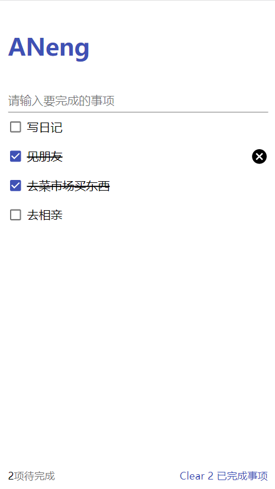

# 技术栈：
react + redux + react-router + material-ui

# UI图（PC&移动端）



# 预览地址：
https://zhonganeng.github.io/React-Todos/build/#/

# 运行项目（Node.js v14.15.2）
```
git clone https://github.com/zhonganeng/React-Todos.git

cd React-Todos

npm i  或者运行  yarn(推荐)

npm start

npm run build （发布）
```

# 说明
已实现“todos”基础功能，仅限学习交流使用！